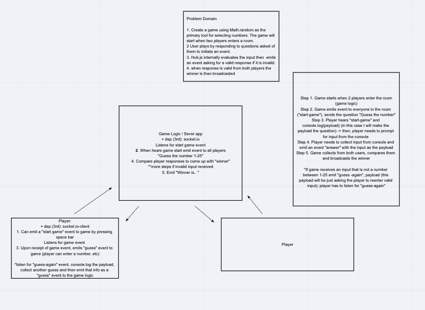

# number-game
Socket.io server app that manages event handling for multi player number guessing game

The number game server starts a name when two players enter the same room. The game generates a random number between 1-25 and prompts the players to guess the number. The game emits to them a ```"start-game"``` event that prompts the player to send a guess back to the program. The game then validates the user input, and resends a request to the player if invalid input was received. The player gets 3 opportunities to send valid input back to the game before the game evaluates the winner. The winner will be the player that guesses a number closest to the value. If a player fails to submit valid input they automatically lose. If neither player submits valid inputs within 3 tries, they both lose.

**Client Apps**

**[Players](./player)**

## Author: Anne Thorsteinson & Clement Buchanen

**[Tests](https://github.com/AnneThor/number-game/actions)**

## Setup

```.env``` requirements:

- ```PORT```
- ```MAX_NO```: can be adjusted upwards to make the game more difficult, default value is 25

## Running the App

- ```npm start```: this will run the app in the console, game play is accessed through the players' terminals

### Overview game logic/control flow

1. Players are automatically assigned to rooms when they connect
2. When 2 players are in a room a game automatically starts
3. Game creates a random number and emits a ```guess-number``` event to the room sockets with a payload containing text saying "Guess the number: "
4. Game listens for "guess" events and uses internal logic to guarantee they are valid inputs (i.e. must be numbers in range)
5. If invalid input is received, game will re prompt for a new guess up to 3x per user
6. When valid inputs are received from each user the game will evaluate the results and broadcast the winner to the room

### Endpoints:

The app runs from the ```/number-game``` namespace

## Tests

- Unit Tests: ```npm run test``` testing is complete for listener functions
- Lint Tests: ```npm run lint```

## UML Diagram


